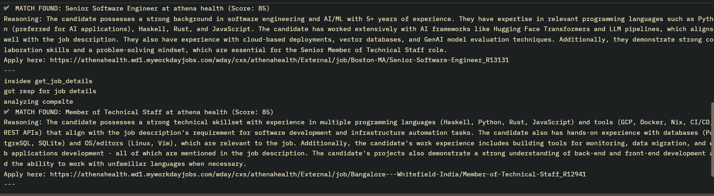

## Job Scanner

**Job Scanner** is a Rust-based tool that scrapes career websites powered by the Workday platform and recommends job postings that match a given resume. It uses a local LLM (via [Ollama](https://ollama.com)) to filter and analyze job listings based on the user's profile.

---

## 🔌 Integrations

* **Workday**: Fetches job listings and details.
* **Ollama**: Performs natural language filtering and matching using local LLMs.

---

## 🚀 Usage

Run the cron-based job scanner every hour:

```sh
cargo run --bin cron_worker
```

---

## 📷 Example



---

## 📦 Prerequisites

Make sure the following tools are installed:

* [Rust](https://rust-lang.org/)
* [Ollama](https://ollama.com/)
* `sqlite3`

---

## ⚙️ Configuration

* Edit your list of companies in [`config.rs`](./src/config.rs).
* Set your resume path and desired Ollama model name in [`cron_worker.rs`](./src/bin/cron_worker.rs).

---

## 🧠 Intentions

The goal of this project is to explore and learn Rust through real-world integrations. It is currently under **active development** — expect breaking changes. Feel free to report issues or suggest improvements!

---

## 🤝 Contribution

Fork, branch, and PR — contributions are welcome!

---

## 📄 License

MIT
